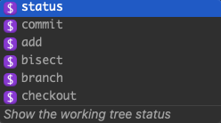

# API

On this page

- [Root Object](#Root Object)
- [Suggestion Object](#Suggestion Object)
- [Subcommand Object](#Subcommand Object)
- [Option Object](#Option Object)
- [Arg Object](#Arg Object)
- [Generator Object](#Generator Object)

### Root Object

The root object is used to define every completion spec. It must be declared as a `var`, not a `const` or `let`, and it must be called `completionSpec`. At it's core, the completion spec is a [Subcommand Object](#Subcommand Object).

```jsx
// Must be "var" NOT "let" or "const")
// Must be "completionSpec" 
var completionSpec = { // this is a Subcommand Object
	...
}
```

### Suggestion Object

Fig parses your completion spec and outputs an array of suggestion objects. Each item you see in the autocomplete menu, with an icon, name, and description, are suggestion objects. You can customize a suggestion object to change its UI and the value that's inserted into the terminal when the user presses enter/tab.



Suggestion objects are mostly internally generated by Fig, except when you define your own `additionalSuggestions`.

| Property Name | Type                       | Required | Default                                                      | Description                                                  |
| ------------- | -------------------------- | -------- | ------------------------------------------------------------ | ------------------------------------------------------------ |
| name          | string or array of strings | ☑        |                                                              | The text that’s suggested in the dropdown list               |
| displayName   | string                     | ☐        | the name prop                                                | Overrides the name property                                  |
| insertValue   | string                     | ☐        | the name prop                                                | The value that's inserted into the terminal when a user presses enter/tab. <br /><br />Can be customized, can insert `{cursor}` in the string to place the cursor after insert.<br />e.g. `git commit -m {cursor} "message"` would place the cursor after -m. |
| description   | string                     | ☐        | null                                                         | The text that gets rendered at the bottom of the autocomplete box. |
| type          | string                     | ☐        | null                                                         | The type of suggestion, one of folder, file, arg, subcommand, option, special |
| icon          | string                     | ☐        | auto-generated based on type prop. If type doesn't exist, will be `?` | The icon that is rendered is based on the type, unless overwritten |

### Subcommand Object

Used to define subcommands under another command. For example, within `git commit`, `commit` is a subcommand of `git`.

Subcommands are recursive by nature.

| Property Name         | Type                               | Required | Default             | Description                                                  |
| --------------------- | ---------------------------------- | -------- | ------------------- | ------------------------------------------------------------ |
| name                  | string or array of strings         | ☑        |                     | Refer to `name` under [Suggestion Object](#Suggestion Object) |
| displayName           | string                             | ☐        | the name prop       |                                                              |
| insertValue           | string                             | ☐        | the name prop       | Refer to `insertValue` under [Suggestion Object](#Suggestion Object) |
| description           | string                             | ☐        | null                | Refer to `description` under [Suggestion Object](#Suggestion Object) |
| subcommands           | array of Subcommand objects        | ☐        |                     | Refer to [Subcommand Object](#Subcommand Object) for the subcommand schema |
| icon                  | string                             | ☐        | the subcommand icon | Refer to `icon` under [Suggestion Object](#Suggestion Object) |
| options               | array of Option objects            | ☐        |                     | Refer to [Option Object](#Option Object) for the Option schema |
| args                  | Arg object or array of Arg objects | ☐        |                     | Refer to [Arg Object](#Arg Object) for the Arg schema        |
| additionalSuggestions | array of Suggestion objects        | ☐        |                     | Refer to [Suggestion Object](#Suggsetion Object) for the suggestion schema. Use additionalSuggestions to make custom suggestions. |


### Option Object

Options are defined to signal to Fig that there may be a flag or option following the subcommand. For example, in the `git checkout -b` command, `-b` is an option of `checkout`.

| Property Name | Type                               | Required | Default | Description                                                  |
| ------------- | ---------------------------------- | -------- | ------- | ------------------------------------------------------------ |
| name          | string or array of strings         | ☑        |         |                                                              |
| displayName   | string                             | ☐        |         |                                                              |
| insertValue   | string                             | ☐        |         | Refer to `insertValue` under [Suggestion Object](#Suggestion Object) |
| description   | string                             | ☐        |         | Refer to `description` under [Suggestion Object](#Suggestion Object) |
| args          | Arg object or array of Arg objects | ☐        |         | Refer to [Arg Object](#Arg Object) for the Arg schema        |
| icon          | string                             | ☐        |         | Refer to `icon` under [Suggestion Object](#Suggestion Object) |

**Note:** We rely on Arg objects to map what the user has typed to a completion spec. e.g. if you were building the git completion spec, under `git commit` you would specify an option for `-m, --message`.

The presence of an Arg object in a Subcommand or Option object will signal that the given subcommand or option will take an arg. It is important to specify it, even if you don't fill in its optional properties.

Entering`args: {}` is enough to inform the parser to expect an argument.


### Arg Object

An object specifying a user generated argument.

| Property Name | Type                                            | Required | Default                                                      | Description                                                  |
| ------------- | ----------------------------------------------- | -------- | ------------------------------------------------------------ | ------------------------------------------------------------ |
| name          | string                                          | ☐        |                                                              | Refer to `name` under [Suggestion Object](#Suggestion Object) |
| displayName   | string                                          | ☐        | the name prop                                                |                                                              |
| insertValue   | string                                          | ☐        | the name prop                                                | Refer to `insertValue` under [Suggestion Object](#Suggestion Object) |
| description   | string                                          | ☐        | null                                                         | Refer to `description` under [Suggestion Object](#Suggestion Object) |
| suggestions   | array of strings or array of Suggestion objects | ☐        | null                                                         | Refer to [Suggestion Object](#Suggsetion Object) for the suggestion schema. Use this prop to specify custom suggestions. |
| icon          | string                                          | ☐        | auto-generated based on type prop. If type doesn't exist, will be `?` | Refer to `icon` under [Suggestion Object](#Suggestion Object) |
| template      | string                                          | ☐        |                                                              | Must be either `"filepaths"` or `"folders"`                  |
| generators    | Generator object or array of Generator objects  | ☐        |                                                              | Generators let you run shell commands on the user's device to *generate s*uggestions for arguments |

**Note**: Nothing is required in an Arg object. The presence of it in a Subcommand or Option object will signal that the given subcommand or option will take an arg. It is important to specify it, even if you don't fill in the details (literally do `args: {},` ) otherwise the parsing will be messed up.

### Generator Object

Generators are used to programatically generate suggestion objects. For example, they can be used to fetch and suggest a list of git remotes, or to grab all the folders in the current working directory.

For more details on generators and their properties, see [Generators](./generators.md).

| Property Name             | Type                                                         | Required | Description                                                  |
| ------------------------- | ------------------------------------------------------------ | -------- | ------------------------------------------------------------ |
| template                  | string                                                       | ☐        | Must be either "filepaths" or "folders"                      |
| filterTemplateSuggestions | function <br />Input: array of Suggestion objects <br />Output: array of Suggestion objects | ☐        | Function that lets you filter the Suggestion objects output by the template. |
| script                    | string OR function<br /><u>function</u> <br />Input: array of strings <br />Output: string | ☐        | The shell command to execute in the user's current working directory. The output is a string. It is then converted into an array of Suggestion objects using `splitOn` or `postProcess` |
| splitOn                   | string                                                       | ☐        | As splitting the output of `script` is such a common use case for `postProcess`, we build the `splitOn` property. Simply define a string to split the output of script on (e.g. `","` or `"\n"` and Fig will do the work of the `postProcess` prop for you. |
| postProcess               | function<br />Input: string<br />Output: array of Suggestion objects | ☐        | Define a function that takes a single input: the output of executing script. This function then return an array of Suggestion objects that will be rendered by Fig. |
| custom                    | async function <br />Input: array of strings<br />Output: array of Suggestion objects | ☐        | Custom Functions let you define a function that takes an array of the user's input, run multiple shell commands on the user's machine, and then generate suggestions to display. |
| trigger                   | string or function<br /><u>function</u><br />Inputs: string, string<br /> Output: boolean | ☐        | Defines a trigger that determines when to regenerate suggestions for this argument by re-running the generators. |
| filterTerm                | string or function <br /><u>function</u> <br />Input: string <br />Output: string | ☐        | A function to determine what part of the string the user is currently typing we should use to filter our suggestions. |

**Note**: At least one of `template`, `script`, or `custom` are **required**. Only one of these three props is allowed per generator.

For more details on generators and their properties, see [Generators](./generators.md).

