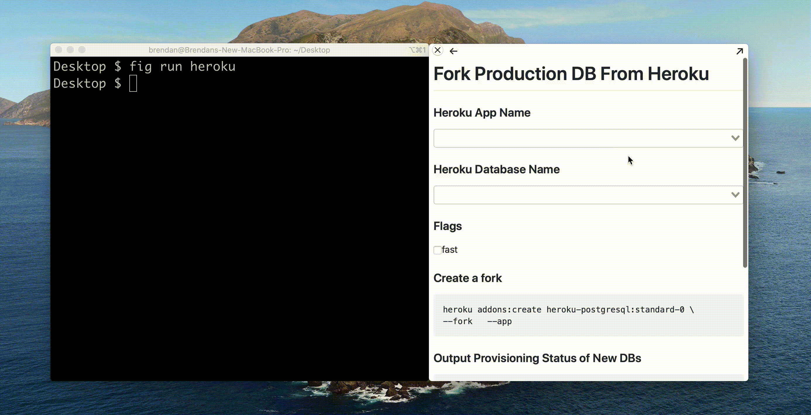
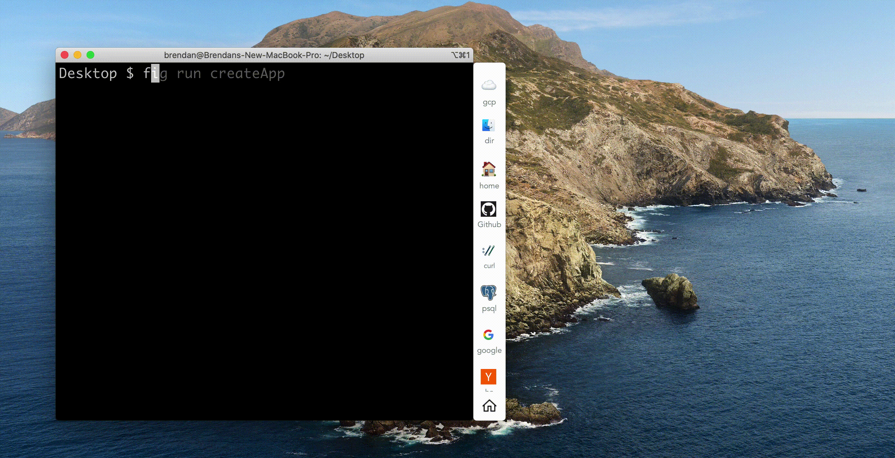

# Interactive Runbooks

Interactive Runbooks make static documents interactive. They live right next to your terminal and are easy to create and share. 

Runbooks are written in [Rundown](). Rundown is based on [Markdown](https://daringfireball.net/projects/markdown/) but also lets you: add form elements, run code blocks, and even run shell commands. Interactive Runbooks use the `.run` file extension.

## Get Started

We recommend using examples to get started.

- Download [full runbooks]()
- View examples for each of the [form elements]()
- Learn how to [run runbooks]()

**You can see some demos below**

