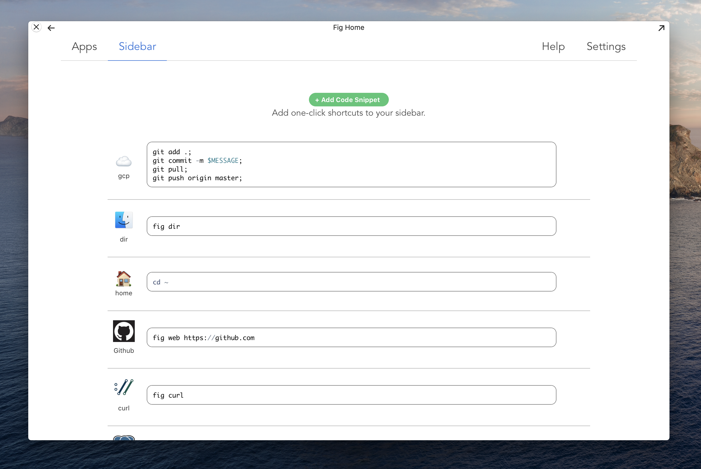

# The Sidebar

The Fig Sidebar attaches to the right of your Terminal. The sidebar gives you one click access to code snippets you use frequently. Clicking on a sidebar item runs it directly in the Terminal for you

## **Adding Items**

You can add and remove items to the Sidebar from Sidebar tab in `fig home`

For each item you can: choose an emoji, add a label, and add a code snippet

**✨Hints**

- Fig suggests some helpful shortcuts at the bottom of the page
- Take advantage of the Fig CLI
  - e.g. `fig web [url]` can quickly open a website for you
  - `fig app_name` will open an app for you
- Installing an App automatically adds it your sidebar (with a nice image too)

## **Next Version**

*The next version of the* ***Fig Sidebar*** *is planned for early-mid August*

**Currently**: The Sidebar is static. The same sidebar will appear next to every terminal window. 

**Next Version**: The Sidebar will be contextual. You will be able to customize your sidebar depending on your environment (like what directory you're currently in, what apps you have open, what your teammates are doing)

Some examples of what a contextual sidebar can do:

- show a readme icon when a readme is in your current directory
- show scripts that are most relevant to a specific directory
- show what apps and scripts are most commonly used by your team in a specific folder