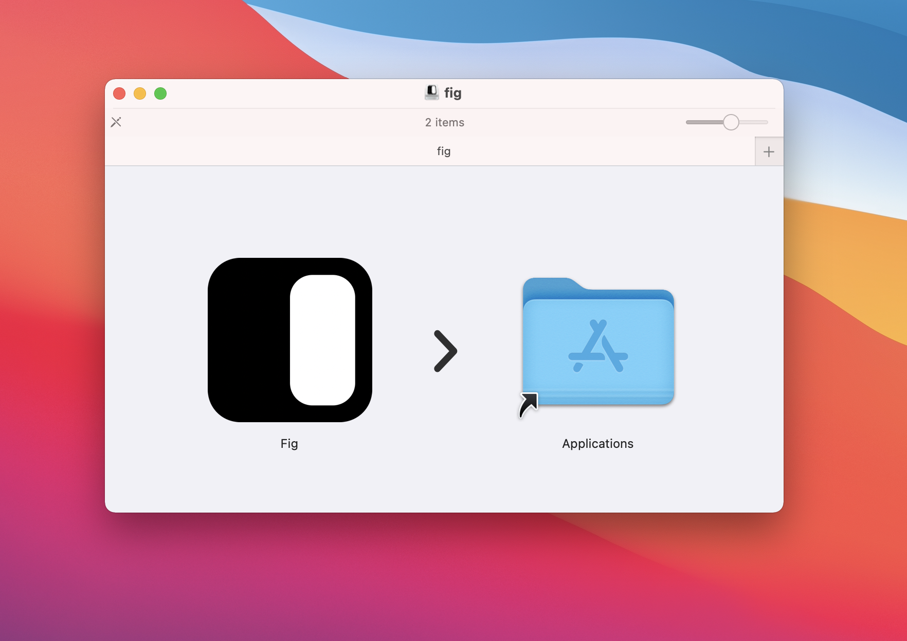
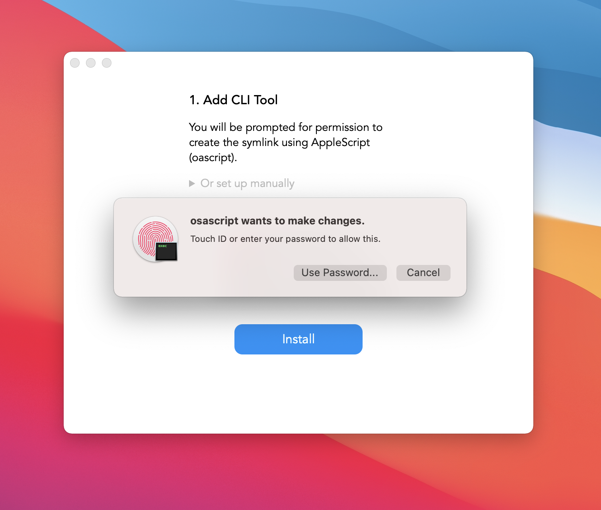
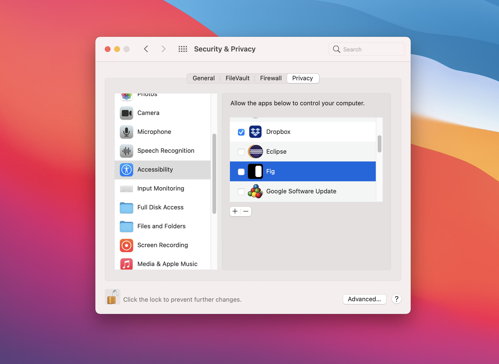
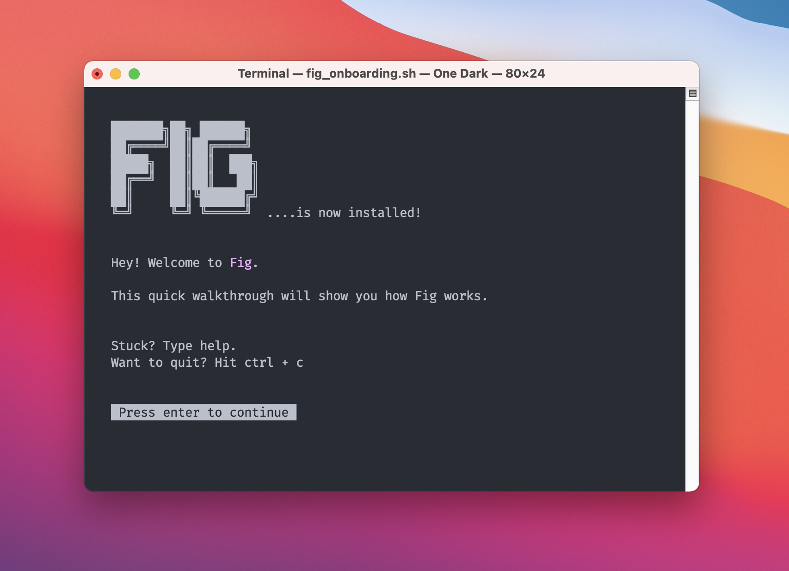

# Installation Steps

## Download

**Fig is currently in private beta.** You can sign up to Fig's waitlist [here](https://withfig.typeform.com/to/GndELJ). We are onboarding new users in batches.

## Installation

### 1. Drag Fig into Applications

Open the .dmg file and drag the Fig file into Applications

### 2. Add the Fig CLI

Open Fig from the applications folder. You can do this from the applications folder, Spotlight, or the launchpad.

Do not open Fig from the icon you saw in step 1.

## **3. Welcome**

### 4. Add CLI tool

This installs the Fig CLI via a symlink.

### 

### 5. Enable Accessibility Permission

Fig uses Accessibility permissions to do its window management. Make sure the checkbox next to Fig is checked. You might have to click the lock in the bottom left.

**Note**: If the Fig sidebar doesn't display on load (e.g. after an update), chances are there is a problem with accessibility permissions.

**Apple Icon (in top left of screen)** → **System Preference → Security & Privacy → Accessibility. -** If Fig is unchecked, check it.

- If Fig is checked, uncheck it, then check it again.

### 

### 6. Login

You can login via email. We suggest you use your work email to make it easy to share internal scripts, runbooks, and CLIs.

### 

### 7. Get Started

If everything goes well, you should see a Terminal pop open telling you Fig was successfully installed. Follow the prompts to learn a bit about how Fig works.

You can open up Fig's settings anytime with `fig`

**Note**: Fig works with any Terminal. Open up iTerm or Kitty!

### 

### 8. Done!

Next up, check out [Getting Started with Autocomplete Specs](https://www.notion.so/Getting-Started-with-Autocomplete-Specs-9ddc5213614c44108b2fedf64b8d0d00) to dive deeper into Fig.

