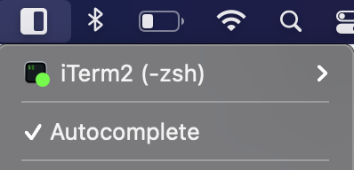
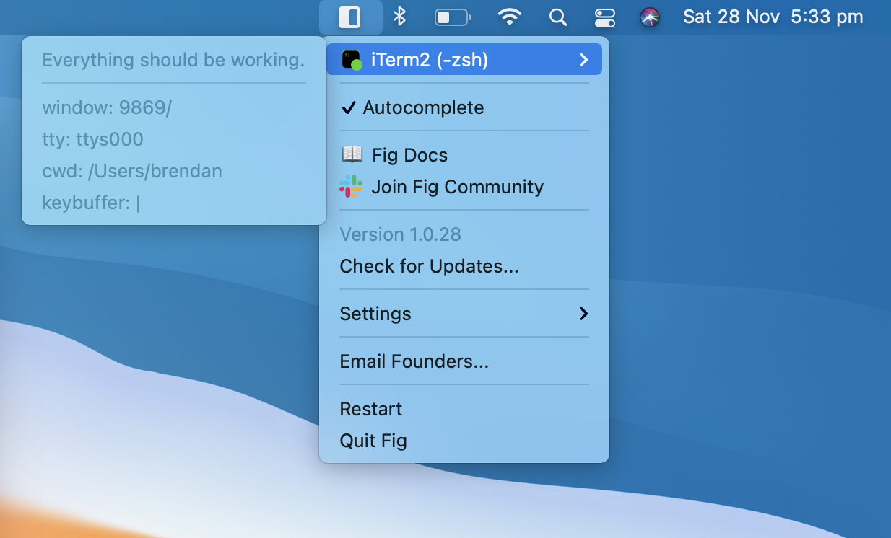
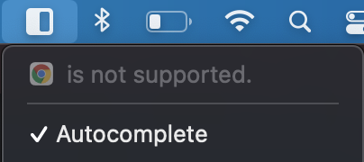

**Note**: the Fig menu is in the **status bar** of your Mac (top right, near the time, wifi, battery etc.)

**Note 2**: You can email Fig at any time [hello@withfig.com](mailto:hello@withfig.com)

## The Fig Autocomplete Popup Isn't Showing

Try these common fixes before looking through the below

- Hit enter a few times in your Terminal
- Make sure Fig is actually open (you should see a ◧ icon in your status bar)
- Make sure Autocomplete is toggled on (with a ✅)



- Restart Fig (◧ → Restart)

## Potential Errors

1. **Terminal Error:** Fig occasionally stops working as you use the Terminal (e.g. when you switch windows, or clear a line etc)
2. **Installation Error.:**Follow these steps if you just updated Fig or installed it for the first time and never had Fig working
3. **Keyboard Hide Keys**

If none of the below work, email [hello@withfig.com](mailto:hello@withfig.com). We are pretty responsive!

### 1. **Terminal Error**

The first item of the Fig menu displays diagnostic information. Make sure a Terminal is the active window then clicking the icon to bring it up.



There are 5 different states.

🟢  **Green**: Fig should be working normally. It shows your window ID, TTY, current working directory, and input for the terminal.

- If the state is green and the autocomplete window still hasn't appeared make sure the `keybuffer` matches the text you have input in your terminal.
- Go to a new line and try retyping the command.

🔴  **Red**: We lost track of your Terminal window. Regain focus by clicking on another window (like Chrome or even the Desktop) then back on the Terminal again.

- If this doesn't Fix this issue, restart Fig.

🟠  **Orange**: We aren’t confident of what you’ve typed. We are abstaining from showing suggestions. This happens when you do things like go into history with the up arrow key or use the greyed-out suggestions from `fish` or `zsh`-Autosuggest using the right arrow key. This is a feature, not a bug. Hit enter to go to a new line to fix.

🟡  **Yellow**: We know your Terminal window, but haven’t linked it to the right TTY. Hit enter to go to a new line in a terminal to fix. Alternatively, run `fig source`

🔵  **Blue**: You are running a process that’s not a shell (zsh/bash). This appears when you are in nano, vim etc. If it appears when you are in a normal shell, please tell us!

- *Force Reset*: Rechecks what process is currently running in the terminal.
- *Add to Whitelist*: This adds the current process to a list of recognized shells. Fig will appear
- *Ignore*: Fig ignores this process entirely. (Use this if a background daemon is preventing Fig from seeing to the shell.)

**Other**: It may show another app’s icon and say it’s “not supported”. This means your most recently active window was that app and Fig does not work with that app.



### 2**. Installation Error**

1. Make sure the Fig App was opened from the Applications Folder (not Downloads, or Desktop etc)
2. Make sure Fig has accessibility permissions enabled

- Fig Menu (◧) → Settings → Developer → Request Accessibility Permission
  - You may have to uncheck then check the Accessibility box

1. Toggle Autocomplete off and on again

- Fig Menu (◧) > Autocomplete

1. Make sure the Fig CLI tool is installed:

- Go to Fig Menu (◧) > Settings > Developer > Install CLI Tool

1. Make sure the autocomplete specs are installed.

- Run `fig update`

1. Quit Fig and restart it

### 3**.** **Keyboard Hide Keys**

- Fig temporarily hides if you hit the 

  ```
  esc
  ```

   key.

  - Typing will cause it to come back

- Fig hides if you hit the ↑ up arrow.

  - Hitting the ↓ down arrow the same number of times will make it come back
  - Going to a new line will make it come back

## The Fig Icon is Bouncing

You need to enable accessibility permissions. See below.

## How do I enable Accessibility Permissions

Fig Menu (◧) → Settings → Developer → Request Accessibility Permission

(This should take you to System Preferences → Security & Privacy → Accessibility)

- Click the lock icon to unlock (you will be prompted for your password)
- If Fig is unchecked, check it. If Fig is checked, toggle it off and then check it again.

## I am getting this error in my shell when running a Fig command or going to a new line

```
› Could not connect to fig.app.

  QUICK FIX
  Check if Fig is active. (You should see the ◧ Fig icon in your menu bar).

→ If not, run open -b com.mschrage.fig to relaunch the app.

  Please email hello@withfig.com if this problem persists.
```

1. Check if the Fig app is open (the ◧ Fig icon should be in your menu bar)
   - If it's open:
     - Restart Fig ( ◧ → Restart)
     - Potentially kill Fig from Activity Monitor
       - See the section on "Quitting Fig" for more details.
   - If it's closed:
     - Open Fig

## I can't press enter in my Terminal

Please email [hello@withfig.com](mailto:hello@withfig.com) if this happens to you. It should never ever happen and we would like to know why!

**To fix:** Quit Fig. If the app is unresponsive, terminate it using the Activity Monitor. See the section on "Quitting Fig" for more details.

## Quitting Fig

Fig runs as a background daemon, so it does not appear in the Dock or the Force Quit menu. You can quit the Fig by clicking on the Fig menubar icon > Quit Fig.

If Fig is not responding, open Activity Monitor and kill the `fig` process.

## Uninstalling Fig

Click the Fig menu icon > Settings > Uninstall Fig. You will be prompted for confirmation. Once the app has quit, you'll be able to safely move the [fig.app](http://fig.app) from your Applications folder to the Trash.

**If Fig has Frozen**

- Quit the Fig App (below)
- Go to Applications and delete the Fig App
- Delete the `.fig` folder from your `~` directory
- Remove Fig from Login Items
  - System Preferences → Users & Groups → Login Items → Remove Fig

## Error messages in Shell Prompt

```sql
$ go_fig: command not found: fig
```

If you are using `zsh` and see an error like this in you command prompt, it means that the `fig` CLI has either been uninstalled or deleted from the `PATH`.

To fix this issue, reinstall the Fig CLI tool:

- Fig menu icon > Settings > Developer > Install CLI Tool

To uninstall Fig entirely:

- Fig menu icon > Settings > Uninstall Fig